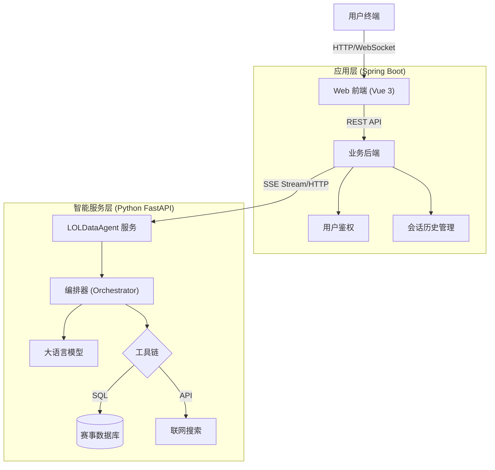

# OpenLoLInsights 系统设计文档

## 1. 系统架构设计

### 1.1 总体架构
本项目采用**前后端分离**架构，并引入独立的**AI Agent 微服务**，形成经典的三层结构：



### 1.2 模块划分
1.  **前端 (LoLSmartStatsWeb/frontend)**
    *   **技术栈**: Vue 3 + TypeScript + Vite + TailwindCSS。
    *   **职责**: 提供聊天界面、Markdown 渲染、图表展示。负责处理 SSE 流式响应，将后端推送的增量文本实时渲染到界面。
2.  **业务后端 (LoLSmartStatsWeb/backend)**
    *   **技术栈**: Java 17 + Spring Boot 3。
    *   **职责**:
        *   API 网关：转发前端请求到 Agent 服务。
        *   用户系统：注册/登录/鉴权。
        *   数据持久化：存储用户的对话历史、收藏的报告。
        *   协议转换：将 Agent 的原始 SSE 流封装或透传给前端。
3.  **AI Agent 服务 (LOLDataAgent)**
    *   **技术栈**: Python 3.10+ + FastAPI + LangChain。
    *   **职责**: 核心推理引擎。接收自然语言指令，通过编排器调度工具，生成最终回答。

---

## 2. 智能体 (Agent) 详细设计

### 2.1 核心编排器 (Orchestrator)
Orchestrator 是 AI 服务的核心大脑，采用**规划-执行-合成 (Plan-Execute-Synthesize)** 模式，而非简单的 ReAct 循环，以提高稳定性和可控性。

#### 2.1.1 处理流程 (Workflow)
1.  **Intent Analysis (隐含在 Prompt 中)**:
    *   接收用户 Query 和 Mode (Simple/Report)。
2.  **Information Retrieval (并行/串行执行)**:
    *   **Step 1: Web Search**: 总是先尝试搜索互联网，获取背景信息（如当前版本、选手近期舆论）。
    *   **Step 2: NL2SQL**: 将 "Query + Search Result" 喂给 LLM，生成 SQL 语句。如果不需要查库，LLM 返回 `NO_SQL`。
    *   **Step 3: DB Query**: 执行 SQL，获取结构化数据。此处包含**智能降级逻辑**：如果 SQL 执行报错，自动忽略 DB 错误，标记为“仅使用 Web 数据”。
3.  **Synthesis (合成响应)**:
    *   将 `Web Search Context` + `DB Query Result` + `System Prompt (Based on Mode)` 组合。
    *   **Simple Mode Prompt**: 侧重简洁、直接回答。
    *   **Report Mode Prompt**: 侧重深度、分层级、引用来源、Markdown 格式。

### 2.2 工具链设计 (Tool Registry)

| 工具名称 | 对应实现 | 功能描述 | 适用场景 |
| :--- | :--- | :--- | :--- |
| **db_tool** | `SQLDatabase` + `SQLAlchemy` | 执行只读 SELECT 查询。内置 Schema Info 提示词。 | 查询 KDA、胜率、BP数据、经济差等客观数据。 |
| **serper_tool** | `Google/Serper API` | 联网搜索实时网页。 | 查询背景故事、转会新闻、游戏版本更新、主观评价。 |
| **rag_tool** | `Chroma` / `FAISS` | (规划中) 检索本地知识库文档。 | 查询英雄技能详情、特定游戏机制说明。 |

### 2.3 智能体 Prompt 策略 (Prompt Engineering)

#### 2.3.1 NL2SQL 转换策略
为了提高 SQL 生成的准确率，我们在 Prompt 中注入了详细的数据库 Schema 描述和 Few-Shot 示例：
*   **Schema 注入**: 包含 Table Name, Create DDL, 以及关键字段的业务含义（如 `Games.blue_team_id` 专门用于计算蓝方胜率）。
*   **Chain-of-Thought (CoT)**: 强制要求 LLM 在生成 SQL 前先输出思考过程 (Thought)，例如 "用户询问的是T1，需要关联 Teams 表与 Matches 表..."。

#### 2.3.2 结果合成策略 (Synthesis)
针对不同模式应用不同的系统提示词：
*   **Simple Mode**: "你是一个乐于助人的助手。直接回答用户问题，不要废话。如果数据库里查到了数据，就用数据库的数据；如果数据库查不到，就用搜索结果。"
*   **Report Mode**: "你是一个专业的电竞数据分析师。请根据以下资料撰写深度报告。要求：1. 使用 Markdown 格式；2. 区分数据来源；3. 给出专业见解而非单纯罗列数字。"

### 2.4 数据库设计 (MySQL)
核心表结构设计以支持复杂的赛事统计查询：

*   **Matches (赛事表)**: 存储大场信息 (BO3/BO5)。
    *   `id`, `tournament_name` (赛事名，如 "25/lpl/第一赛段"), `match_date`, `team1_id`, `team2_id`, `winner_id`.
*   **Games (小局表)**: 存储每一小局的红蓝方及胜负。
    *   `id`, `match_id`, `blue_team_id`, `red_team_id`, `winner_id` (用于计算红蓝方胜率).
*   **Players (选手表)**: 选手基础信息。
    *   `id`, `name` (游戏ID).
*   **PlayerGameStats (选手表现表)**: 原子级统计数据。
    *   `game_id`, `player_id`, `hero_id`, `kills`, `deaths`, `assists`, `gold_earned`, `total_damage`.

---

## 3. 接口设计 (API)

### 3.1 对话流接口 (SSE)
*   **Endpoint**: `POST /api/v1/ai/chat/stream`
*   **设计理由**: LLM 生成耗时较长，必须使用 SSE (Server-Sent Events) 提供流式体验。
*   **Request Body**:
    ```json
    {
      "query": "分析 T1 战队 S15 赛季表现",
      "mode": "report",  // 或 "simple"
      "sessionId": "..."
    }
    ```
*   **Event Types**:
    *   `meta`: 会话元数据。
    *   `step`: 推送 Agent 的中间思考步骤 (如 "正在搜索...", "正在查询数据库...")，用于前端展示进度条或日志。
    *   `token`: LLM 生成的文本片段。
    *   `done`: 结束信号。

### 3.2 文件下载接口
*   **Endpoint**: `GET /api/v1/ai/files/{file_id}`
*   **设计理由**: Report 模式下，生成的长报告可能需要保存为本地文件供用户存档或二次编辑。

---

## 4. 容错与降级设计
*   **数据库异常**: 当 `db_query` 抛出 OperationalError (如连接断开、缺少驱动) 时，Orchestrator 捕获异常，并在最终 Prompt 中指示 LLM "通过 Web 搜索结果回答"，而非报错。
*   **Search API 限流**: 若 Serper API 超额，回退到由于 LLM 自身知识库进行回答。
