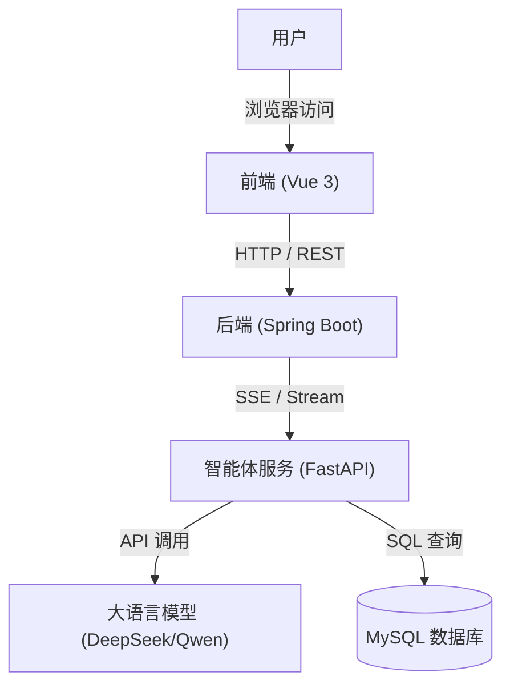

# OpenLoLInsights

OpenLoLInsights 是一个集成了大语言模型（LLM）的英雄联盟（League of Legends）数据智能分析与问答系统。项目采用前后端分离架构，并引入独立的智能体（Agent）服务来处理复杂的自然语言查询和数据检索任务。

## 🏗️ 系统架构规划

本项目的核心架构由三个主要部分组成，各部分通过 HTTP 协议进行通信：



### 组件说明

1.  **Frontend (前端)**
    *   **技术栈**: Vue 3, TypeScript, Vite
    *   **端口**: `5173` (默认)
    *   **职责**: 提供用户交互界面，展示游戏数据图表和智能问答对话框。

2.  **Backend (后端)**
    *   **技术栈**: Java 17, Spring Boot 3.2
    *   **端口**: `8080`
    *   **职责**: 处理业务逻辑，管理用户会话。对于普通请求直接响应；对于需要 AI 分析的问题，通过 `WebClient` 与 Agent 建立 SSE 连接，获取流式回复并转发给前端。

3.  **Agent (智能体服务)**
    *   **技术栈**: Python, LangChain, FastAPI
    *   **端口**: `8000`
    *   **职责**: 
        *   作为独立的微服务运行，基于 `FastAPI` 提供 HTTP 接口。
        *   集成 RAG (检索增强生成) 和 Text-to-SQL 能力。
        *   接收后端的 Prompt，调用 LLM 生成回答，并通过 SSE (Server-Sent Events) 流式返回结果。

## 🚀 快速启动

### 环境准备

请确保本地环境已安装以下工具：
*   **Python**: 3.8+
*   **Java**: JDK 17+
*   **Node.js**: 18+
*   **MySQL**: 8.0+

### 1. 启动智能体服务 (Agent)

Agent 负责核心的 AI 逻辑。

```bash
cd LOLDataAgent
# 安装依赖
pip install -r requirements.txt
# 配置环境变量 (参考 config/.env.example)
# 启动服务 (规划目标：启动 HTTP Server 监听 8000 端口)
python main.py
```

> **注意**: 请确保在 `LOLDataAgent/config/.env` 中正确配置了 `QWEN_API_KEY` 或 `DEEPSEEK_API_KEY` 以及数据库连接信息。

### 2. 启动后端服务 (Backend)

后端负责协调前端与 Agent。

```bash
cd LoLSmartStatsWeb/backend
# 运行 Spring Boot 应用
mvn spring-boot:run
```
后端服务启动后将监听 `http://localhost:8080`。

### 3. 启动前端应用 (Frontend)

前端提供可视化界面。

```bash
cd LoLSmartStatsWeb/frontend
# 安装依赖
npm install
# 启动开发服务器
npm run dev
```
访问终端输出的地址（通常是 `http://localhost:5173`）即可使用系统。

## 📂 目录结构导航

*   [LOLDataAgent](./LOLDataAgent/README.md): Python 智能体代码及详细文档。
*   [LoLSmartStatsWeb](./LoLSmartStatsWeb/README.md): Web 前后端项目根目录。
    *   [Backend](./LoLSmartStatsWeb/backend/README.md): Spring Boot 后端文档。
    *   [Frontend](./LoLSmartStatsWeb/frontend/README.md): Vue 前端文档。
